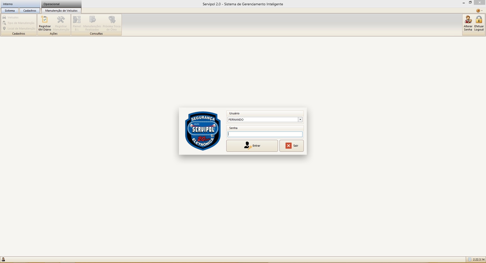
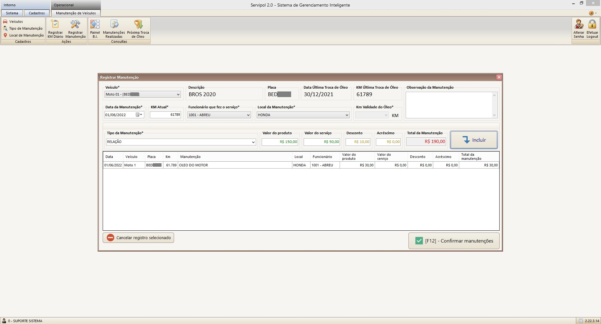
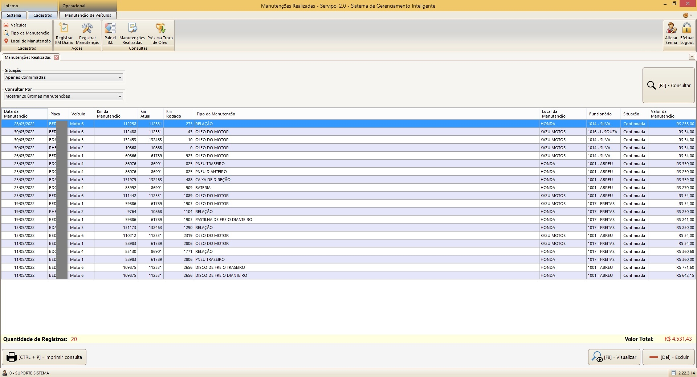

<h1 align="center" style="max-width: 250px; margin: 30px 0;">
    Servipol 
<h4 align="center">
  Aplicação desenvolvida em C# com DevExpress + PostgreSQL para controle de manutenção de veículos, cadastro de funcionários e equipamentos da empresa Servipol.
</h4>
 

## :sunny: Algumas imagens da aplicação

  

      
      
      

